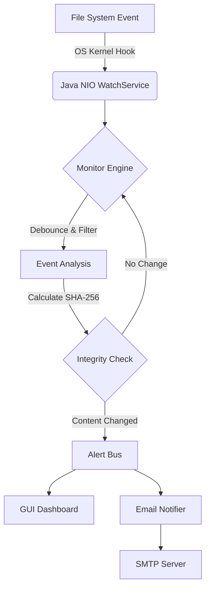

# Real-Time File Integrity Monitor (FIM) - Project Report

## 1. Introduction

### Background of the Problem Domain
In the realm of cybersecurity, maintaining the integrity of the filesystem is paramount. Unauthorized modifications to system files, configuration settings, or application binaries can be indicators of a security breach, malware infection (such as ransomware), or insider threats. Traditional security measures often focus on network perimeter defenses, but once an attacker bypasses these, they often seek to establish persistence by modifying files. File Integrity Monitoring (FIM) acts as a critical internal defense layer, providing visibility into the "who, what, and when" of file changes.

### Motivation for Choosing the Project
The motivation behind developing this Real-Time File Integrity Monitor lies in the limitations of traditional, schedule-based integrity checkers. Many existing solutions rely on periodic scanning (polling), which creates a "blind spot" between scans where an attacker could modify a file and revert it before the next check. Furthermore, polling large filesystems is resource-intensive, causing CPU spikes and I/O bottlenecks. This project aims to solve these issues by leveraging event-driven architecture (using Java NIO's `WatchService`), ensuring that changes are detected the instant they occur with minimal system overhead.

### Importance / Relevance of the Project
As cyber threats evolve, the "dwell time" (time between a breach and its detection) remains a critical metric. A real-time FIM drastically reduces this window from days or hours to milliseconds. This project is highly relevant for compliance standards (like PCI-DSS, HIPAA, and GDPR) which often mandate integrity monitoring. Beyond security, it is also valuable for DevOps and system administration to track configuration drift and debug unexpected application behavior caused by file changes.

## 2. Problem Statement

### Clear and Concise Description
The core problem is the lack of immediate, granular visibility into filesystem activities in standard operating environments. Files can be created, deleted, or modified without leaving an easily accessible audit trail, making it difficult to detect sophisticated attacks or unauthorized changes until significant damage is done.

### Limitations of Existing Systems
*   **High Latency:** Periodic scanners (cron jobs) leave large windows of vulnerability.
*   **Resource Heavy:** Constantly reading the entire disk to check for changes consumes significant CPU and disk I/O.
*   **False Positives:** Many tools rely solely on file timestamps or sizes, alerting on benign events (like a file being "touched" without content change).
*   **Lack of Context:** Basic logs often fail to correlate related events, such as seeing a "Delete" and "Create" sequence as a single "Rename" or "Move" operation.

### Need for the Proposed System
There is a distinct need for a lightweight, real-time solution that connects directly to OS-level kernel events. The system needs to be smart enough to distinguish between superficial metadata changes and actual content corruption using cryptographic verification.

## 3. Objectives of the Project

The primary objectives of this project are:

*   **To design and implement** a real-time monitoring engine using Java NIO `WatchService` to capture filesystem events (Create, Modify, Delete) instantly.
*   **To analyze** and correlate raw OS events to detect complex user actions, specifically distinguishing "Move" and "Rename" operations from simple delete/create pairs.
*   **To develop a secure and scalable solution** that utilizes SHA-256 cryptographic hashing to verify the integrity of file contents, ensuring alerts are only generated for actual data modifications.
*   **To reduce false positives** by implementing "debouncing" logic that filters out rapid, redundant intermediate events often generated by the OS during file write operations.
*   **To implement a user-friendly GUI** (Graphical User Interface) that visualizes the stream of tracking events in real-time, providing immediate situational awareness to the user.
*   **To integrate an automated alerting notification system** via SMTP (Email) to ensure system administrators are notified of critical integrity violations even when not monitoring the dashboard.

## 4. Proposed Methodology / Solution Approach

### System Architecture
The system follows a multi-threaded, event-driven architecture. The core **Monitor Engine** runs as a background daemon, hooking into the Operating System's filesystem notifications. It maintains a **State Management** layer that compares the live file state against a secure **Baseline** (a known-good snapshot of file hashes). Events are processed and published to a decoupled **Alert Bus**, which then distributes them to consumers like the GUI Dashboard and the Email Notifier service.

### Flow of the System

### Algorithms / Models
*   **Cryptographic Hashing:** The system uses the **SHA-256** algorithm to generate unique fingerprints for files. This ensures that even a single bit change in a file is detected, while identical content with different timestamps is ignored.
*   **Heuristic Event Correlation:** An algorithm is employed to detect "Renames". It holds "Delete" events in a temporary buffer and checks if a matching "Create" event (with the same file hash) appears within a short time window (e.g., 1.2 seconds), fusing them into a single "Rename" or "Move" alert.
*   **Debouncing:** A temporal filter aggregates rapid-fire "Modify" events (common when software saves a file in chunks) into a single stable event to update the hash.

### Tools, Frameworks, and APIs
*   **Programming Language:** Java (JDK 17+)
*   **Core API:** `java.nio.file.WatchService` for kernel-level monitoring.
*   **GUI Framework:** Java Swing (customized with a flat, modern dark theme).
*   **Mail API:** Jakarta Mail 2.0 used for the alerting subsystem.
*   **Concurrency:** `java.util.concurrent` (Executors, BlockingQueues) to handle high-throughput event streams without blocking the UI.
